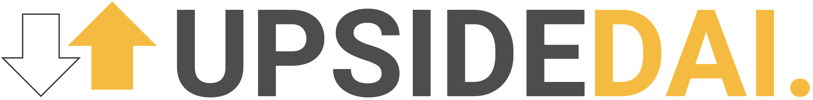
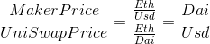
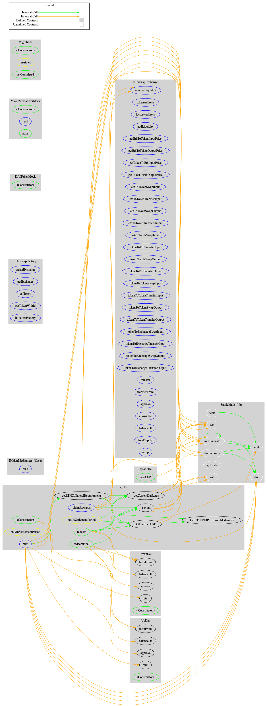

# UpsideDai [](https://circleci.com/gh/Daichotomy/UpSideDai/tree/master) [](https://coveralls.io/github/Daichotomy/UpSideDai?branch=master)



## Resources

[Live Application](https://upsidedai.com)  
[Pitch deck](https://docs.google.com/presentation/d/1qZtUZ2vuH_k8AtWUEa444_UhoD8DlzgenaHmmxuohMU)  
[Figma mockups](https://www.figma.com/file/561C0EC33s556EpVKYBzG2/Eth-Denver?node-id=8%3A0)  

## Table of Contents

- [What is UpSideDai](#what-is-upsidedai)
- [Team](#team)
- [Financial engineering](#financial-engineering)
  - [On-chain Price of Dai in USD](#on-chain-price-of-dai-in-usd)
  - [Calculating The Settlement Price Of The CDF](#calculating-the-settlement-price-of-the-cdf)
  - [Incentives For Market Makers](#incentives-for-market-makers)
  - [Transaction Flow](#transaction-flow)
- [Technical Description](#technical-description)
  - [Local Development Setup](#local-development-setup)
  - [Smart Contracts](#smart-contracts)

---

## What is UpSideDai??

UpsideDai is a **highly leveraged** contract for difference (CFD) built on Dai, Uniswap and Maker. This mechanism enables traders and speculators to bet on and hedge against price fluctuations of Dai by buying leveraged long or short positions. The CFD construction enables high leverage (20x) while remaining capital efficient and not requiring high margin requirements (100% collateralization). Positions are priced against the market observable Dai/Usd price by using a combination of the Maker oracle and Uniswap.

UpsideDai's CFD uses two tokens within the platform: UpDai and DownDai which represent long and short positions against the price of Dai. A market maker deposits 2 Dai into the platform to create 1 upDai and 1 downDai. When Dai is trading at par with the dollar (1Dai = 1Usd) then

```
 1 upDai = 1 downDai = 1 Dai = 1 Usd
```

As the price of Dai fluctuates around 1 Usd value flows between the upDai and downDai tokens. The sum of the upDai and downDai token is always equal, netting price action between the tokens This means that irrespective of the price of Dai a pair of upDai and downDai tokens yields 2 Dai in underlying. **For example if the price of Dai is trading at 1.02 Usd then the long token is worth 1.4 Dai and the downDai is worth 0.6 Dai**.

The price that Dai can fluctuate around the peg is bounded by the leverage used by the CFD. UpsideDai's 20x leverage places a bound on the price of Dai between 1.05 and 0.95 Usd per Dai. This bound is reasonable as Dai has not broken this bound in over a year. However if Dai was to hit one of the bounds, say it's trading at 1.05, then the long token is worth 2 Dai and the short Dai is worth 0 Dai. If a wider bound is wanted then either less leverage should be used or more collateralization is required.

## Team

🇮🇪 Alex Scott - Smart contracts and integrations

🇨🇴 Diego Mazo - Product and front end design

🇿🇦 Chris Maree - Financial engineering and front end

🇹🇳 Haythem Sellami - Smart contracts and front end

## Financial engineering

A contract for difference is a contract between two parties stipulating that the buyer will pay to the seller the difference between the current value of an asset and its value at contract time. UpsideDai's implementation pays out the difference between the price of Dai and 1 USD with **20x leverage**. A CFD is a synthetic contract, representing synthetic price exposure to an underlying fictitious asset. As such it requires a maturity at which tokens can be redeemed for underlying. This ensures that the price of the token in the secondary market has a low tracking error to the underlying price feed.

### On-chain Price of Dai in USD

At settlement the price of Dai in Usd is needed to define how much each upDai and downDai tokens are redeemable for. This _could_ be build using an oracle but we chose to rather find a trustless on-chain representation of the price of Dai. This is found by getting the Eth/Usd price from the Maker Medianzer and the Eth/Dai price from Uniswap. The uniswap price divided by the Maker medianizer price yields the current on chain price of Dai without needing an oracle or external price feed. Numerically this can be defined as follows:



### Calculating The Settlement Price Of The CDF

Contracts in UpsideDai run for a one month maturity. At settlement token holders can redeem their upDai and downDai for a representative amount of underlying Dai. The amount of Dai that they can redeem(`payout`) is a function of how many `upDai` or `downDai` they hold, the settlement price of Dai in Usd(`p`), leverage(`L`) and market fees(`f`). This is expressed as follows:


If a token holder only has upDai or downDai then they yield the commensurate amount from that position. If a market maker holds equal amounts of both tokens they yield their full underlying + fees and interest (more on this in the next section).

### Incentives For Market Makers

A key element of UpsideDai is an incentive mechanism to encourage liquidity provision from market makers. This is done in a number of ways:

1. All underlying is invested into the DSR using Chai to yield interest on deposits over the life span of the contract. This is redeemable by the market makers when they redeem at maturity of the contract
2. Uniswap pools generate 0.3% fees on all trades, which is given to market makers.
3. Redemption from the CDF charges a fee `f` of 0.3% which also goes to the market makers.

These three sources of revenue makes being a liquidity provider for UpsideDai more profitable than investing in the money market or DSR while having minimum risk.

### Transaction Flow

xxx

## Technical Description

xxx

### Local Development Setup

For local development it is recommended to use [ganache](http://truffleframework.com/ganache/) to run a local development chain. Using the ganache simulator no full Ethereum node is required.

As a pre-requisite, you need:

- Node.js
- npm


### Smart Contracts

